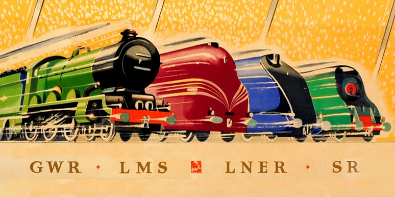
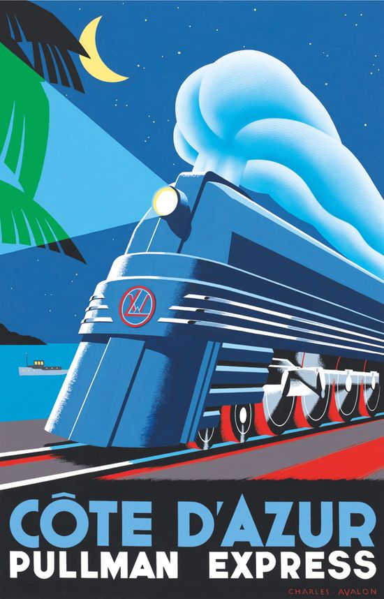
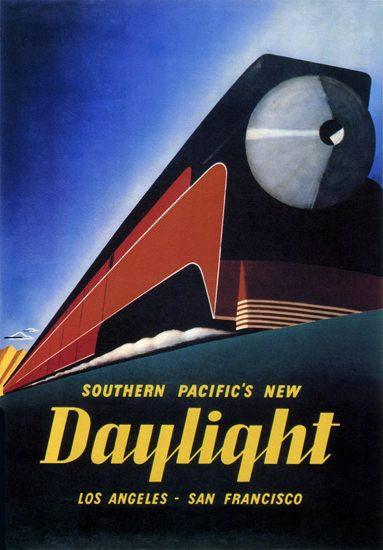
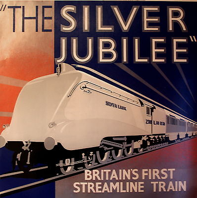
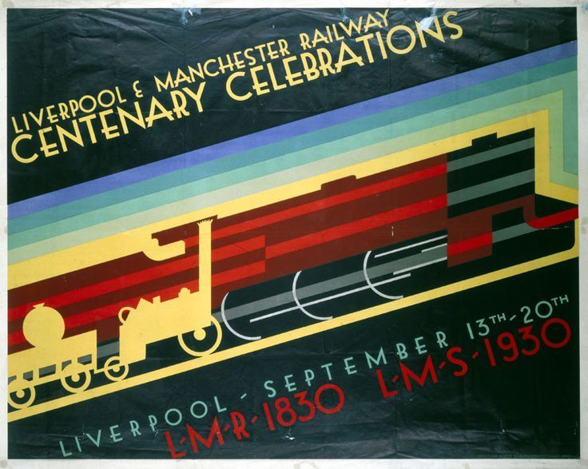
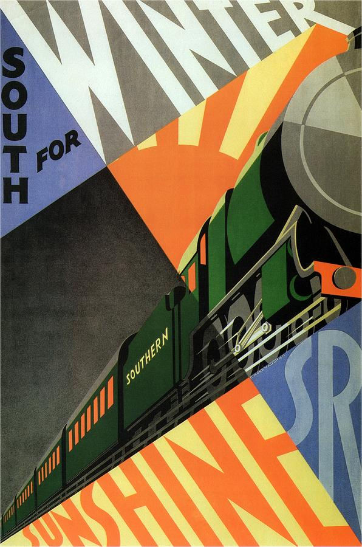
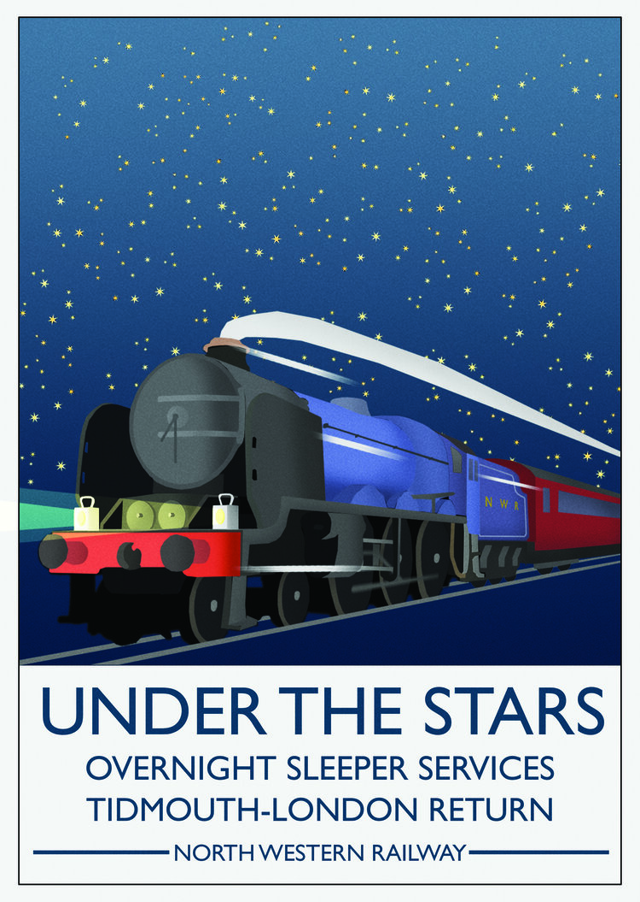
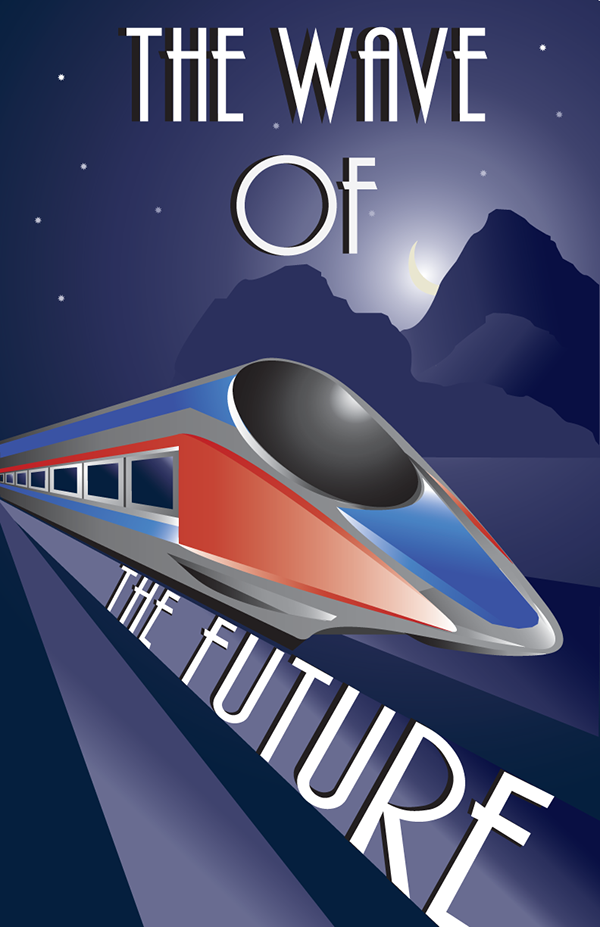
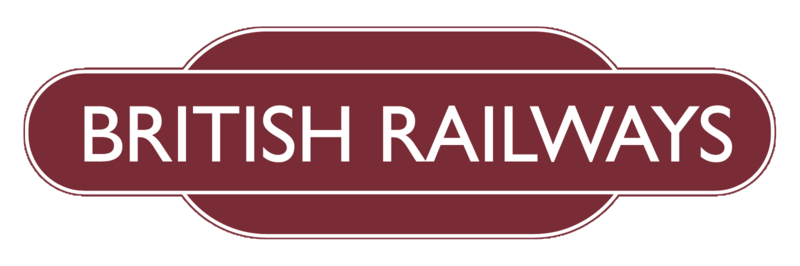

# Untitled Rails Game
by Mat Booth
:toc:

## Concept

A railway business simulation and management game directly inspired by the classic 1990 DOS game *Sid Meier's Railroad Tycoon*, the first of the Railroad Tycoon series of games.

It is an open-ended management simulator where the player is given a small amount of initial investor funding and tasked with running a railway with the aim of growing it from a small company into a huge empire. The operation of the railway includes building tracks and stations and managing locomotives and rolling stock whilst fighting off the AI competition's rival railway companies.

### Rationale

The two reasons I am making this game are nostalgia and education.

Railroad Tycoon holds a great deal of nostalgia for me as the most-loved game of my childhood and I've always wanted a modern reimplementation of it including features I've always wanted and quality-of-life changes that modern technology allows, such as:

* Obviously fancier modern graphics and allow for smooth panning and zooming.
* Optional limit on number of trains or stations (original game limited both to 32), while I always wanted unlimited trains, having a limit is probably good for creatively building railway networks.
* No bridge washouts. Since only one bridge could be washed out at a time, it was too easy workaround by building a cheap second backup river crossing, and it doesn't add anything to the late game when you can afford more advanced bridges.
* No ferry services, instead we'll have more advanced bridge types that can span ocean tiles.
* Better mouse-based UX for track building.
* Optional hexagon tile map mode instead of square tile map. (Hexagons are the bestagons.)
* Procedurally generated maps that are larger than the original.

NOTE: It is important to note I am making the game that I want to play. *I am the target audience.* There is no other real consideration for the design of the game.

The development of the game will also be an exercise in learning about game design and game engine design. The consequences of this are:

* This document will be a best-effort attempt to comprehensively document the design of game, both in a high level sense and more detailed technical sense. Some of the information in this document will come from direct experience with the Railroad Tycoon game and/or Russell Sipe's official guide book. There will be differences compared to the original game that will be explicitly noted, but where some behaviour is not specified here the original game should be used as a reference.
* Much of what could be done with off-the-shelf game engines or libraries will likely be intentionally reimplemented from scratch. This should not be considered a defect; it was almost certainly a valuable learning experience.
* The game will also be developed in the open and the code will be open source licensed, in the remote chance that others can also learn from it.

### Title

In consideration of the name of the game, here are some potential titles:

* Maybe something related to railway business like *Railway Company Ltd* or *<Something> Railway Company*
* *Permanent Way*/*The Permanent Way*, the term for installed rails, sleepers and ballast intended to carry trains

Rejected titles:

* *Rails* for Railroad Tycoon's executable RAILS.EXE (too generic, there are several existing games with this name)
* *Open Rails* to emphasise the game's open source development model (there is already an excellent open source train simulator with this name, see: http://openrails.org/)
* Anything else found on Steam tagged as a train game: https://store.steampowered.com/tags/en/Trains/

## Design

### First Five Minutes

When the player starts a new game they are presented with the map of the world, and an amount of money to spend. Panning and zooming shows there are towns, cities and industries scattered about the map. The player looks for a good place to build their first station, maybe they pause the game and find two cities near to one another -- it wouldn't cost much to connect them and there are nearby prospects for future expansion. The player builds some track between the two nearby cities and places a station at each end of the line. With track laid and stations built, the player builds their first train. Choice of locomotive is limited at first, but rolling stock can be added according to the supply and demand of the stations. With its itinerary set, the newly built train sets off on its inaugural service and when it arrives at its destination the money starts rolling in. The player has been thinking about where to expand their rail network next, but wait! An AI has founded a competing railway company in a nearby city; now the race is on to build the biggest railway empire in the land...

### Primary Loop: The Operational Game

The primary gameplay loop is all about construction and operations side of running a railway. This involves the two major activities of building out the railway network and scheduling trains.

#### Railway

Building out the railway network with track and stations requires the player to make consideration of the following:

* Geography:
** Steep grades will slow down trains, to the detriment of all services except slow freight.
** Tunnels can be made through especially hilly regions, and bridges built over rivers, but both are expensive.
* Competition:
** The AI competition may force the player to expand in one direction by cutting them off in another.
** The player may want to prioritise building to a particularly profitable-looking city before the AI does.
* Expansion:
** Considering where to build next may influence the design of the player's current construction project.
** Space may need to be left for creating junctions and signal boxes for a future branch line.
** Station catchment areas may not overlap, preventing stations from being built too close to each other.

Both track and stations can be upgraded:

* Track can be doubled, allowing simultaneous two way train traffic between signals.
* Signal boxes can be added to track, allowing increased train traffic in one direction.
** Usually only one train can occupy a section of track, by splitting the track into more sections using signals you can increase the through-put of the line.
* Stations can be increased in size to increase their catchment area.
* Ancillary buildings can be added to stations, such as locomotive works, goods warehouses and hotels.

#### Trains

Only a few types of locomotive are available at the start of the game but each locomotive will advantages and disadvanges, requiring the player the make consideration of the following:

* Consist:
** Faster cargoes are more time-sensitive and pay more for quicker delivery so locomotives with a higher top speed are more ideal.
** Slower cargoes that are less time-sensitive make sense on longer trains pulled by slower, but more powerful locomotives.
** Whether the consist will change at any point, for example when dropping off raw resources and picking up manufactured goods might require changing to different cars. Switching time counts against delivery time.
* Routes:
** Trains are built at any station with a locomotive works improvement, so it pays to build the train close to where it will run.
** Whether there are other trains using part of the route, a new slow freight service will hold up faster passenger services using the same track.
** The route is determined by adding scheduled stops to a train's itinerary and choosing the service type.
** The service type determines whether it's a local service that calls at every station between scheduled stops or more of an express service that calls at only the major stations, or limited service calling only at the explicitly scheduled stations.

Trains can also be upgraded. As new locomotives become available it might be desirable to replace existing locomotives with ones more suited to the service being provided. Increased maintenance costs of aging locomotives may also mean that a replacement locomotive is the best way to keep a service at maximum profitability. Trains may also be retired if no longer needed.

### Secondary Loop: The Economic Game

The secondary gameplay loop involves the broader goals of expanding the players' railway empire and dominating the AI competition.

#### In-Game Economy

TODO

#### AI Competition

TODO

### Goals and Incentives

In open-ended games it can sometimes be useful to give the player something to work towards rather than letting them build track aimlessly. To this end, the game will periodically two kinds of optional mission:

* Priority deliveries. A large bonus is available for delivering a specific cargo between two stations. The bonus deteriorates over time, incentivising speedy delivery. If ignored, the bonus will decay to nothing and the mission will be cancelled.
* Connection bounties. A town or city may offer a large cash bonus for connecting their city to your railway network. AI competitors may also claim the bounty if they beat the player to it.

The only mandatory goal for the game is to not be sacked by the company shareholders.

### Game End

The game will end either by being sacked by the shareholders, or after 100 years.

The shareholders value growth, so the player may be sacked after several consecutive disappointing fiscal periods.

If the player makes it to 100 years they will be congratulated and possibly their scores and stats are recorded for the purpose of submitting to a global scoreboard and/or getting acheivements. The player can have the option of continuing indefinitely if they are having fun on the current map, but there are no further awards or acheivements for doing so.

## Look and Feel

The game will be reminiscent of the steam hey-day of British rail travel in the early twentieth century. Somewhat art-deco style UI with maybe a stylised cell-shaded look, in the vein of these stylised railway posters:

   

   

See also the old art-deco "flying sausage" British Railways logo and signage:

The type-face used on the above signage is called https://en.wikipedia.org/wiki/Gill_Sans[Gill Sans] and is a design classic that was used by both British Railways and some of the pre-nationalisation groupings. It is understood that the copyrights to this type-face are now expired.

## Technical Aspects

### The Map

The game map consists of square or hexagonal tiles of land and sea created from a procedurally generated height map. Procedural generation means it will not resemble any real world place, but can be unique for every play-through. The map will also have procedurally placed rivers, towns and industries. Town names will be procedurally generated to and look somewhat like British place names to go with the look and feel. Each land tile will have some attributes associated with it:

* Altitude (for calculating track grade, which affects a locomotive's speed) which just needs to be a value of 0-255 for tiles above sea level.
* Terrain type, which has an associated right-of-way cost affecting the cost of laying track. See the section on link:#_laying_track[laying track] for the full list of terrain types and their right-of-way costs.
* List of haulable cargo types that the tile produces or is able to receive.
* Station type that was built on the tile.
* Track configuration that was laid on the tile (single or double tracked, and whether it is tunneled or bridged).

The configuration options for map generation, including the random seed, should be easily sharable for example by pastable text string. As a stretch goal, consider adding an editor for players to construct their own maps and allow exporting and importing such custom made maps.

TODO growth and expanding cities

### Laying Track

With the exception of the very first piece of track laid, all new track must be connected to the existing railway network.

A piece of track will occupy two half-tiles on the map, from the centre of one tile to the centre of an orthogonally adjacent or diagonally adjacent tile. If track enters a tile from one direction, track may be built that exits the tile in another direction if and only if the curve in the track does not exceed 90°, i.e. turns tighter than 90° are prohibited. Similarly, track may enter or exit the tile from a third direction to form a junction if and only if the angle between the third direction and one of the other directions is less than 90°, i.e. perfect T-junctions and cross-roads are prohibited.

TODO illustrate valid and invalid track configurations

Each terrain type has an associated right-of-way cost which is charged per half-tile. The cost of laying a piece of track is therefore the base cost of the track plus the right-of-way costs of the two half-tiles that the piece of track occupies.

[cols="1,4,1,4"]
|===
|Tile Type|Rights-of-Way/Half Tile|Tile Type|Rights-of-Way/Half Tile

|River
|Free

|Clear
|£2,000

|Forest
|Free

|Farmland
|£6,000

|Fens
|Free

|Slums
|£8,000

|Hills
|Free

|Village
|£10,000

|Mountains
|Free

|City
|£20,000

|Ocean
|Free

|Industry
|£10-50,000
|===

The base cost of the track, cost of doubling track, track maintenance cost, and right-of-way costs all vary according to the current economic climate. The base and upgrade costs are given below along with a multiplier for right-of-way and maintenance costs. The base maintenance cost is £35 per month per full tile of track.

[cols="2,2,2,4"]
|===
|Economic Climate|Base Cost|Doubling Cost|Multiplier

|Panic
|£4,000
|£12,000
|0.67

|Recession
|£5,000
|£14,000
|0.83

|Moderation
|£6,000
|£16,000
|1

|Prosperity
|£7,000
|£18,000
|1.17

|Boom
|£8,000
|£20,000
|1.33
|===

There are no additional right-of-way costs when upgrading single track to double and there is no cost for downgrading double track to single. Tiles containing stations are automatically double tracked and do not have to be manually upgraded. Tunnels and wooden trestle bridges may not be double tracked.

When removing track, only the right-of-way costs are recovered.

#### Bridges

Track may be laid across rivers by building bridges. Bridges may only be built in a straight line, and unless otherwise noted they may cross only one river tile. The cost of building a bridge does not include the cost of building the track. Different types of bridge offer different advantages:

[cols="2,2,6"]
|===
|Type|Cost|

|Wooden Trestle
|£50,000
|Single track only.

|Steel Girder
|£200,000
|May be double tracked, not immediately available.

|Stone Masonry
|£400,000
|May be double tracked.

|Suspension
|£600,000/tile
|May be double tracked, not immediately available, also able to span a limited number of ocean tiles.
|===

Unlike the original game, bridges will not washout and there are no ocean-going ferry services.

#### Tunnels

When laying track on a sufficiently steep grade, as calculated from the difference in altitude between adjacent tiles, the option will be given to build a tunnel instead. On extremely steep grades the option to build ordinary track will not be given, which may make some mountain tiles impassable except via tunnel. Track within a tunnel is treated as if it is perfectly flat, with no grade, and therefore does not affect the speed of locomotives, with the drawback that track within tunnels cannot be doubled. The tunnel will be perfectly straight and the exit point will be the first tile with approximately the same height altitude as the entrance point.

The cost of a tunnel is the number of full tiles on which track will be laid (distance between centres) multiplied by 40,000 and the economic climate multiplier described in the link:#_laying_track[laying track] section. No additional costs are incurred for the base cost of the track or rights-of-way i.e., tunnel building is all-inclusive.

#### Tile Adjacency

An additional multiplier is applied to the overall track laying and maintenance costs for pieces built between diagonally adjacent tiles, which scales the cost according to the increased distance between tile centres. This multiplier also applies to tunnels, but not bridges.

[cols="2,1,7"]
|===
|Tile Adjacency|Multiplier|

|Square Orthogonal
|1
a|image::design-resources/sq_orth_adj.png["",125]

|Square Diagonal
|1.41
a|image::design-resources/sq_diag_adj.png["",125]

|Hexagon Orthogonal
|1
a|image::design-resources/hex_orth_adj.png["",125]

|Hexagon Diagonal
|1.73
a|image::design-resources/hex_diag_adj.png["",125]
|===

### Placing Stations

The player must build new stations on existing track in the rail network. A station will occupy one tile on the map, either a tile that contains the end of a track, or a tile that contains straight track only i.e., it is prohibited to place a station on a tile that contains any curves or junctions.

There are several types of station from which to choose, each with differently sized catchment areas, with larger catchment areas costing more to place. The catchment area is defined as a radius (number of rings of tiles) around the tile containing the station and when placing a new station, and may not overlap with another station's catchment area. A proposed new station's catchment area is shown so the player can position it optimally.

[cols="2,1,1,6"]
|===
|Station Type|Cost|Catchment Radius|

|Signal Box
|£25,000
|0
|Not actually a station, it is used to break track up into smaller blocks to inscrease a line's throughput. See the section on link:#_signal_blocks[signal blocks] below.

|Halt
|£50,000
|1
|A small unstaffed station for passengers or a goods-only depot.

|Station
|£100,000
|2
|A moderately-sized station or terminus for passengers and goods.

|Interchange
|£200,000
|3
|A large, regionally important station or terminus.
|===

All stations types implicitly include the functionality of signal boxes, but signal boxes are not themselves stations. I.e., trains cannot load/unload passengers or cargo at signal boxes, but since they don't have a catchment area the rules about catchment area overlap do not apply to signal boxes.

Stations may be upgraded or downgraded by building a different type of station over an existing station. When upgrading, the discount on the cost of the new station is determined by the station type from which the player is upgrading. When downgrading, the refund is determined by how many levels the station is being downgraded. Stations may only be upgraded if the catchment area overlap rules allow.

[cols="1h,1,1,1,1"]
|===
|From -> To|Signal Box|Halt|Station|Interchange

|Signal Box
|N/A
|£12,000 discount
|£12,000 discount
|£12,000 discount

|Halt
|£12,000 refund
|N/A
|£24,000 discount
|£24,000 discount

|Station
|£24,000 refund
|£12,000 refund
|N/A
|£48,000 discount

|Interchange
|£48,000 refund
|£24,000 refund
|£12,000 refund
|N/A
|===

When created, stations are given names according to the nearest town. If such a named station (e.g., *Bolton*) already exists, then a positional suffix (e.g., *Bolton West*, *Bolton Central*) or nearby geographic or railway feature suffix (e.g., *Bolton Forest*, *Bolton Hills*, *Bolton Junction*) will be added. The game will try not to duplicate station names, which is helpful for creating train itineraries.

TODO station maintenance

#### Station Improvements

Train stations may be improved by building ancilliary buildings that provide various benefits described below. The very first station placed by the player comes with a free Locomotive Works.

[cols="1,1,6"]
|===
|Improvement|Cost|

|Locomotive Works
|£100,000
|Allows the building of new locomotives and also functions as an Engine Shed.

|Engine Shed
|£25,000
|Makes train maintenance cheaper. Trains that come to a full stop at a station with an Engine Shed at least once per fiscal period will have greatly reduced maintenance costs. Cannot be built at a station that has a Locomotive Works.

|Marshalling Yard
|£50,000
|Reduces the time it takes to change the consist of train when removing one type of car and adding another type of car. A multiplier of 0.25 is applied to the marshalling times.

|Warehouse
|£25,000
|Storage for perishable fast-freight. Prevents manufactured goods waiting for pickup from deteriorating over time.

|Cold Storage
|£25,000
|Storage for perishable fast-freight. Prevents food products waiting for pickup from deteriorating over time.

|Livestock Pens
|£25,000
|Storage for perishable fast-freight. Prevents livestock waiting for pickup from deteriorating over time.

|Post Office
|£50,000
|Storage for perishable fast-freight. Prevents mail waiting for pickup from deteriorating over time.

|Restaurant
|£25,000
|Increases the income received from delivering passengers to the station by £2000 per car.

|Hotel
|£100,000
|Increases the income received from delivering passengers to the station by £5000 per car.
|===

### Signal Blocks

All stations and signal boxes act as track signals. The length of track between signals is one block, including track that branches off at a junction to the next signal on the branch. By default, signals prevent the movement of trains such that only one train may occupy a single track block or two trains (one in each direction) for blocks that are entirely double tracked.

The player may override the default signal behaviour and set one of two additional modes. Each station or signal box has one signal for each direction of travel and the behaviour mode may be set for each signal individually.

[cols="1,7"]
|===
|Signal Mode|Behaviour

|Normal
|Default mode, allows a train to proceed if the following block is clear, holds the train otherwise.

|Hold
|All trains are held indefinitely at this signal.

|Proceed
|The next train may proceed through this signal whether the following block is clear or not. After a train goes through this signal, the mode switches back to normal.
|===

Any number of trains may be held at a hold signal i.e., when a train reaches a signal it is considered to have exited the preceeding block, which is cleared for the next train. When a signal holding multiple trains clears to proceed, the trains may enter the block one at a time in the normal way according their class. Higher class trains like passenger services get higher priority at signals than lower class trains like slow freight services.

If two trains encounter each other on the same block of train, they collide and both locomotives and all the cars in both trains, including all loaded cargo are destroyed. This may affect the shareholders' opinion of the player and the supply of the cargos that were destroyed, which is temporarily eliminated from all stations in the network.

### Building Trains

New locomotives may be built at any station with the locomotive works improvement. Not all locomotive types are available at the start of the game, but more types will unlock as the game progresses.

[cols="2,2,6"]
|===
|Type|Cost|

|TODO
|TODO
|
|===

Once a locomotive is built, its initial set of cars is chosen. Up to eight cars may be added to a train, in any combination. The available cars are divided into 5 classes and the most common class of car in the train determines the train's overall class. A train's class may affect the treatment it receives at signals, where higher class trains are given priority. Each class of car also has its own weight characteristics that is used to determine the speed of the train pulling it. The set of cars making up a train is known as its consist.

[cols="2,2,2,4"]
|===
|Class|Priority|Unloaded Weight|Loaded Weight

|Mail
|0 (Highest)
|190
|290

|Passengers
|1
|180
|300

|Fast Freight
|2
|160
|320

|Slow Freight
|3
|140
|340

|Bulk Freight
|4 (Lowest)
|80
|400
|===

#### Scheduling

Setting the route of a train can be done after it is built by adding up to four scheduled stops. The train will make its way between these stops and after the final stop, will make its way back to the first. The train will always stop at the scheduled stations, but the train may also be assigned a type that determines whether they also stop at stations in between the scheduled stops.

[cols="2,8"]
|===
|Type|Behaviour

|Local
|Stops at all stations between scheduled stops. This is the default type.

|Through
|Stops at all stations between scheduled stops except for halts. I.e., stations or interchanges.

|Express
|Stops at all stations between scheduled stops except for halts and stations. I.e., interchanges only.

|Limited
|Stops at scheduled stops only.
|===

For each scheduled stop, the consist of the train may be configured to change to allow dropping off one type of cargo and picking up another. A train may also be given a wait-until-full order for any of its scheduled stops. This causes the train to wait at a scheduled stop until all of its cars are fully loaded before setting off.

As well as the four regular scheduled stops, a train may be assigned a priority order to temporarily change its route or consist. A priority station stop will cause the train to deviate from its schedule and go the prioritised destination before resuming its normal schedule. A priority consist will cause the train to change cars at the next station it stops at, instead of waiting until the next scheduled stop for a change of consist.

TODO switching/unloading times
TODO revenues

#### Named Trains

Locomotives are not named unless a train breaks a new speed record, in which case its locomotive may be given a name, either a random name generated by the game, or a name of the player's choice. Trains with a named locomotive gain a 25% bonus on passenger revenue. Names are kept if the locomotive is upgraded, but the name is lost if the locomotive is retired.

## Road to a Prototype

See the ticket list under https://github.com/mbooth101/rails-game/milestone/1[the first milestone].

## References

* __Sid Meier's Railroad Tycoon.__ MicroProse, 1990 [Video Game]
* Sipe, Russell. __The Official Guide to Sid Meier's Railroad Tycoon.__ Compute Books, 1991 [ISBN: 0874552443]
